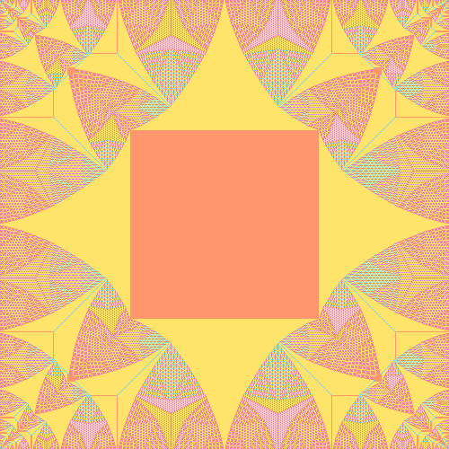

# Abelian Sandpiles

Implementation of the abelian sandpile model, written in rust. 
It is possible to generate the identity sandpile for a given size, as well as just
dropping grains in the middle of the square grid. More information about
[abelian sandpiles](https://en.wikipedia.org/wiki/Abelian_sandpile_model).

 

